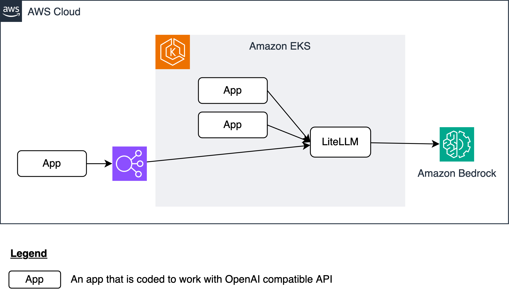

# Architecture
The diagram below depicts the solution architecture. [LiteLLM](https://www.litellm.ai/) is used as a proxy to translate the API call originating from the app in OpenAI format to Bedrock format.

LiteLLM is deployed on Amazon EKS. If the app is hosted on the same cluster, it can access LiteLLM internally through Kubernetes `Service` of `type` `ClusterIP`. If the app is hosted outside the cluster, LiteLLM has to be exposed via a load balancer -- refer to [Exposing applications](https://www.eksworkshop.com/docs/fundamentals/exposing/) section of Amazon EKS workshop for guidance. This implementation assumes the app is hosted on the same cluster.

While LiteLLM is only used as a proxy in this implementation, it has several other features e.g. retry/fallback logic across multiple deployments, track spend & set budgets per project, etc.
